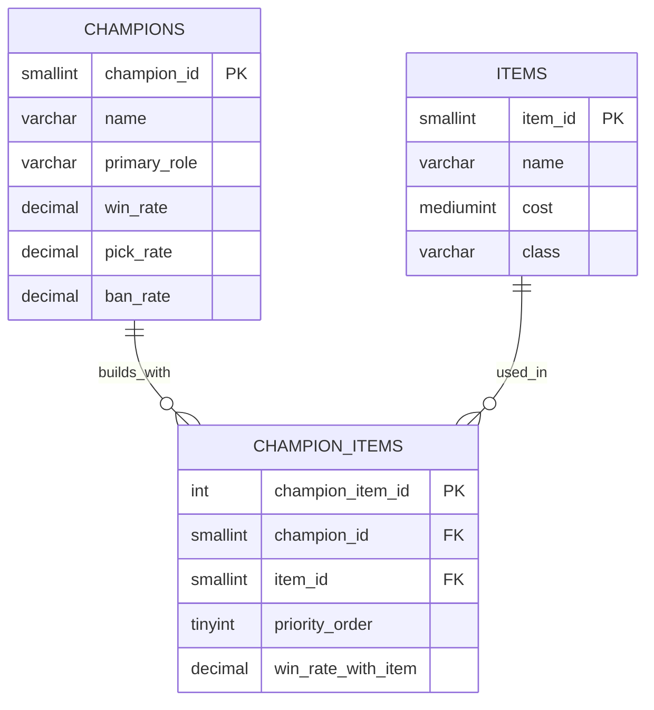

# League of Legends Build Optimizer Database

---

## Database Summary Report

### Intended Audience

This database was created for the League of Legends competitive gaming community, specifically players who want to optimize their builds based on statistical data. League of Legends is a Multiplayer Online Battle Arena (MOBA) game where players select champions and build items throughout the match to enhance their champion's abilities. With over 170 champions and 300+ items, determining item builds can be overwhelming and confusing for players at all skill levels.

The data for this database was pulled directly from u.gg, a leading League of Legends statistics platforms that aggregates millions of matches to provide win rates, pick rates, and performance metrics. This database models the relationship between champions, items, and their combined effectiveness to help players make informed decisions during champion select and in-game backing.

### User Perspective

FIXME

---

## Database ER Model

### Database Design

This database design follows third normal form (3NF) to eliminate redundancy and ensure data integrity. The design separates champions, items, and their relationships into distinct tables to avoid issues. The `champions` table stores champion-specific attributes that are independent of items, while the `items` table contains item properties that exist regardless of which champion uses them. The `champion_items`junction table represents the many-to-many relationship between champions and items, as each champion can build multiple items and each item can be built on multiple champions.

A key design choice was storing `win_rate_with_items` in the junction table rather than calculating it. This denormalization improves query performance for the most common use case, retrieving optimal builds, and accurately reflects that win rates are specific to the champion-item combination. The `priority_order` field indicates the recommended purchase sequence, which is crucial for gameplay decisions. Primary and foreign keys enforce referential integrity, ensuring that champion-item relationships only reference valid champions and items.

The database uses appropriate data types for each field: smallint for champion_id and item_id, mediumint for cost, tinyint for priority_order, varchar for text, and decimal for percentages. The indexes on foreign keys optimize join operations, which are frequent in this application.

### Table Descriptions

**champions**:
Stores information about each playable champion in League of Legends, including their name, primary role (Jungle, ADC, Support, etc.), and performance statistics such as win rate, pick rate, and ban rate across all matches.

**items**:
Contains all purchasable items in the game with their cost and classification (Starter, Basic, Epic, Legendary). This table design enables filtering and sorting items by price and category.

**champion_items**:
A junction table that links champions to their optimal items, storing the priority order for building items and the specific win rate achieved when that champion builds that item. This table enables querying the best item builds for any champion.

---

## SQL Code Blocks

- [Create Tables](https://github.com/awahl2/Database-Management-Systems/blob/main/final_project/create_table.sql#L2)
- [Insert Items](https://github.com/awahl2/Database-Management-Systems/blob/main/final_project/insert_items.sql)
- [Insert Champions](https://github.com/awahl2/Database-Management-Systems/blob/main/final_project/insert_champions.sql)
- [Insert Champion + Item Combos](https://github.com/awahl2/Database-Management-Systems/blob/main/final_project/insert_champion_items.sql)
- [Queries](https://github.com/awahl2/Database-Management-Systems/blob/main/final_project/queries.sql)
- [Delete Tables](https://github.com/awahl2/Database-Management-Systems/blob/main/final_project/queries.sql)

---

## Reports

FIXME

---
