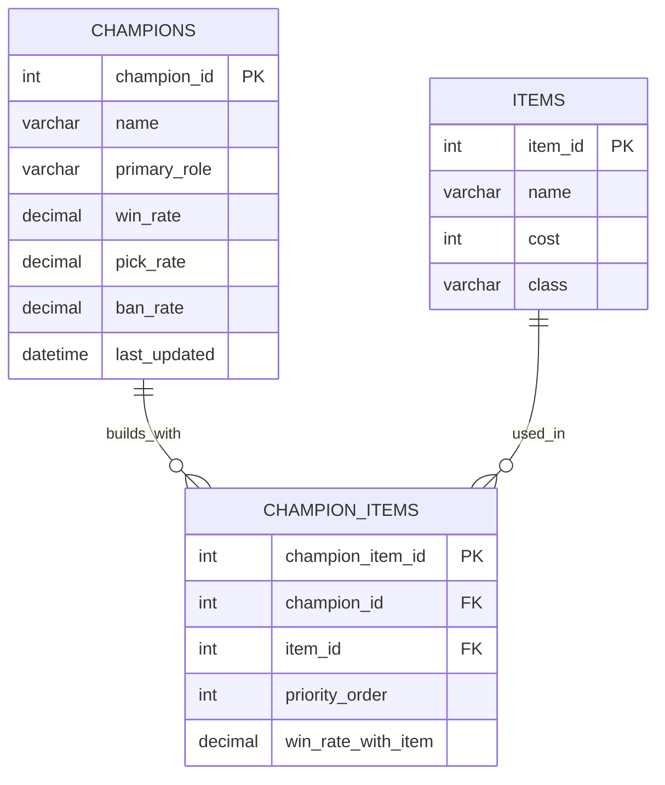

# League of Legends Build Optimizer Database

---

## Database Summary Report

### Intended Audience

This database was created for the League of Legends competitive gaming community, specifically players who want to optimize their builds based on statistical data. League of Legends is a Multiplayer Online Battle Arena (MOBA) game where players select champions and build items throughout the match to enhance their champion's abilities. With over 170 champions and 300+ items, determining item builds can be overwhelming and confusing for players at all skill levels.

The data for this database was pulled directly from u.gg, a leading League of Legends statistics platforms that aggregates millions of matches to provide win rates, pick rates, and performance metrics. This database models the relationship between champions, items, and their combined effectiveness to help players make informed decisions during champion select and in-game backing.

### User Perspective

FIXME
---

## Database ER Model

