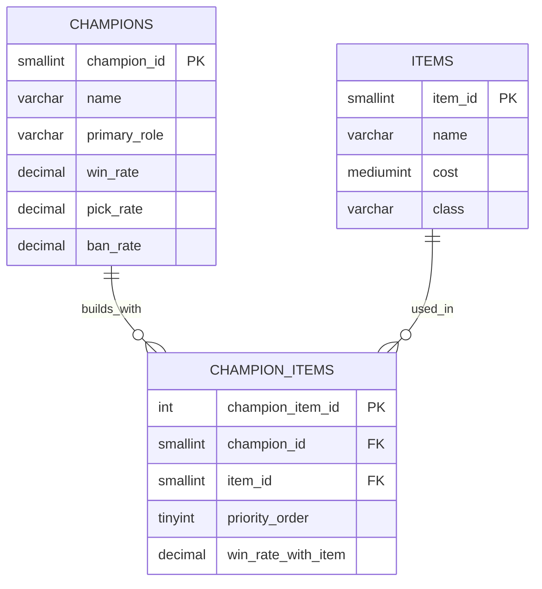

# CS 415 Database Project

---

## Database Summary Report
### Project Overview
This database was created for the League of Legends competitive gaming community, specifically players who want to optimize their builds based on statistical data. League of Legends is a Multiplayer Online Battle Arena (MOBA) game where players select champions and build items throughout the match to enhance their champion's abilities. With over 170 champions and 300+ items, determining item builds can be overwhelming and confusing for players at all skill levels.

The data for this database was pulled directly from u.gg, a leading League of Legends statistics platform that aggregates millions of matches to provide win rates, pick rates, and performance metrics. This database models the relationship between champions, items, and their combined effectiveness to help players make informed decisions during champion select and in-game backing.

### User's View
From the user’s perspective, this database makes creating builds significantly easier. Players can quickly look up any champion, explore item options, and view recommended optimal builds.

They can also track win rates for both items and champions, allowing them to easily identify the current meta picks for each season.

By the end of each Act, the database can also generate helpful reports—such as the top-performing champions and the most effective items. Centralizing all this information in one place ensures that the data is accurate, consistent, and simple to analyze.

---
## Database ER Model



### Database Design Description

The database for the League of Legends build system is organized around three core normalized entities: champion, item, and champion_item. Each table is designed to store a focused set of information. Champions contain attributes specific to each character; items represent the various in-game objects that can be purchased; and the champion_item table links the two together. Structuring the data this way avoids unnecessary duplication and provides a clean, maintainable foundation for analysis.

During normalization, a deliberate choice was made to keep champion and item information entirely separate. For example, item names, costs, and stats are not copied into the champion_item table. Instead, that junction table stores only the foreign keys (champion_id and item_id) along with details that are unique to the pairing. This prevents update anomalies—for instance, if an item’s name or cost changes, only one row needs to be updated in the items table rather than several across related tables. Because every non-key attribute in each table depends solely on its primary key, the design satisfies Third Normal Form (3NF).

Another important design decision was to store win_rate_with_item directly in the champion_item table rather than calculating it dynamically. While this is a mild form of denormalization, it serves a practical purpose: win rates are specific to champion-item combinations, and storing them greatly improves performance for the database’s most common queries, such as retrieving optimal builds. The priority_order field is also included to represent the recommended sequence in which items should be purchased, which is essential for modeling real gameplay decisions and for generating accurate build suggestions.

`champions`
The champions table stores the key attributes associated with each playable character, such as champion_id, name, role, and other identifying features. Any build or win-rate data must reference a valid champion from this table.

`items`
The items table contains the attributes of each in-game item, including item_id, name, cost, and statistical effects. These properties exist independently of which champion uses them. Storing items in a dedicated table ensures consistency and prevents duplicate item data across other tables.

`champion_items`
The champion_items table represents the many-to-many relationship between champions and items. It stores champion_id and item_id as foreign keys, along with pairing-specific fields such as win_rate_with_item and priority_order. This table is central to all build-related queries and supports reporting on optimal item combinations, meta trends, and performance comparisons.

Together, these design choices create a normalized, efficient, and scalable structure. By centralizing champion and item data while capturing detailed build statistics in the junction table, the database provides accurate insights and fast query performance for players, analysts, and developers.

---

### Create Tables

The following SQL creates the `items`, `champions`, and `champion_items` tables in the current database. This does not create the database, only the tables.

```
-- ==========================================
-- CHAMPIONS TABLE
-- Stores playable champions in the game
-- ==========================================
CREATE TABLE champions (
    champion_id SMALLINT PRIMARY KEY AUTO_INCREMENT,
    name VARCHAR(50) NOT NULL,
    primary_role VARCHAR(20) NOT NULL,
    win_rate DECIMAL(5,2),
    pick_rate DECIMAL(5,2),
    ban_rate DECIMAL(5,2),
    INDEX idx_role (primary_role),
    INDEX idx_win_rate (win_rate)
);

-- ==========================================
-- ITEMS TABLE
-- Stores consumable and non-consumable items
-- ==========================================
CREATE TABLE items (
    item_id SMALLINT PRIMARY KEY AUTO_INCREMENT,
    name VARCHAR(100) NOT NULL,
    cost MEDIUMINT NOT NULL,
    class VARCHAR(30),
    INDEX idx_cost (cost),
    INDEX idx_class (class)
);

-- ==========================================
-- CHAMPION ITEMS TABLE
-- Links Champions to their builds
-- ==========================================
CREATE TABLE champion_items (
    champion_item_id INT PRIMARY KEY AUTO_INCREMENT,
    champion_id SMALLINT NOT NULL,
    item_id SMALLINT NOT NULL,
    priority_order TINYINT NOT NULL,
    win_rate_with_item DECIMAL(5,2),
    FOREIGN KEY (champion_id) REFERENCES champions(champion_id),
    FOREIGN KEY (item_id) REFERENCES items(item_id),
    INDEX idx_champion (champion_id),
    INDEX idx_item (item_id),
    INDEX idx_win_rate (win_rate_with_item)
);
```

---

### Insert Data
The following insert statements are for the `champions` (x171), `items` (x308), and `champion_items` (x954) tables in the current database.

`champions`
```
-- ==========================================
-- champion data (171 rows)
-- ==========================================

INSERT INTO champions (
        name,
        primary_role,
        win_rate,
        pick_rate,
        ban_rate
    )
VALUES ('aatrox', 'top', 49.78, 9.7, 11.7),
    ('ahri', 'middle', 50.82, 6.3, 1.7),
    ('akali', 'middle', 49.62, 6.7, 11.1),
    ('akshan', 'middle', 50.98, 3.3, 4.2),
    ('alistar', 'support', 49.34, 5, 2.2),
    ('ambessa', 'top', 49.34, 7.6, 11.9),
    ('amumu', 'jungle', 50.75, 2.1, 1.3),
    ('anivia', 'middle', 51.04, 3.1, 2.5),
    ('annie', 'middle', 50.84, 1.4, 0.5),
    ('aphelios', 'adc', 49.41, 6.1, 2.6),
    ('ashe', 'adc', 51.86, 15.8, 10.6),
    ('aurelion sol', 'middle', 51.46, 2.4, 0.7),
    ('aurora', 'middle', 49.23, 3.4, 4.4),
    ('azir', 'middle', 44.34, 3.8, 0.7),
    ('bard', 'support', 50.89, 7.6, 4.1),
    ('bel''veth', 'jungle', 51.92, 2.1, 6.3),
    ('blitzcrank', 'support', 51.49, 6, 14.8),
    ('brand', 'support', 49.64, 2.2, 1.5),
    ('braum', 'support', 49.71, 5.6, 6.4),
    ('briar', 'jungle', 50.76, 3.7, 6.5),
    ('caitlyn', 'adc', 49.31, 15.9, 18.9),
    ('camille', 'top', 48.93, 3.8, 1.5),
    ('cassiopeia', 'middle', 52.24, 1.9, 1.9),
    ('cho''gath', 'top', 51.08, 2.9, 0.8),
    ('corki', 'adc', 47.75, 3, 0.6),
    ('darius', 'top', 50.18, 7.8, 15.9),
    ('diana', 'jungle', 50.98, 6.2, 8.6),
    ('dr. mundo', 'top', 48.06, 3.9, 5.9),
    ('draven', 'adc', 50.19, 5.2, 22.5),
    ('ekko', 'jungle', 51.01, 4.7, 2.6),
    ('elise', 'jungle', 50.56, 2.5, 3.2),
    ('evelynn', 'jungle', 50.2, 2.3, 3.3),
    ('ezreal', 'adc', 48.42, 13.9, 3.2),
    ('fiddlesticks', 'jungle', 50.8, 2.1, 2.2),
    ('fiora', 'top', 51.02, 4.3, 8.4),
    ('fizz', 'middle', 51.46, 3.6, 4.4),
    ('galio', 'middle', 48.77, 4.3, 2.6),
    ('gangplank', 'top', 50.39, 3.5, 2.2),
    ('garen', 'top', 51.02, 6.6, 4.5),
    ('gnar', 'top', 49.53, 3.2, 1),
    ('gragas', 'top', 50.03, 2.8, 1.4),
    ('graves', 'jungle', 49.99, 9, 8.5),
    ('gwen', 'top', 50.58, 3.7, 5.8),
    ('hecarim', 'jungle', 49.93, 3.8, 3.7),
    ('heimerdinger', 'top', 50.83, 0.9, 1.3),
    ('hwei', 'middle', 50.86, 5.3, 4.2),
    ('illaoi', 'top', 49.99, 1.9, 3.2),
    ('irelia', 'top', 50.7, 4.4, 13.8),
    ('ivern', 'jungle', 52.23, 1.3, 0.7),
    ('janna', 'support', 51.74, 5, 1.5),
    ('jarvan iv', 'jungle', 50.75, 9.5, 4.2),
    ('jax', 'jungle', 50.64, 4.2, 15.5),
    ('jayce', 'top', 49.15, 4.4, 5.8),
    ('jhin', 'adc', 49, 11.8, 1),
    ('jinx', 'adc', 51.56, 12.7, 3.2),
    ('k''sante', 'top', 46.14, 5.8, 4.2),
    ('kai''sa', 'adc', 50.36, 26.6, 5.5),
    ('kalista', 'adc', 47.69, 1.6, 0.2),
    ('karma', 'support', 50.26, 9.7, 5.7),
    ('karthus', 'jungle', 50.33, 1.7, 2.2),
    ('kassadin', 'middle', 51.68, 3.1, 3.5),
    ('katarina', 'middle', 50.7, 7, 9.5),
    ('kayle', 'top', 51.79, 3.4, 4.2),
    ('kayne', 'jungle', 50.19, 6.1, 6.1),
    ('kennen', 'top', 51.53, 1.8, 1.4),
    ('kha''zix', 'jungle', 51.12, 7.7, 6.5),
    ('kindred', 'jungle', 51.26, 3.2, 4.2),
    ('kled', 'top', 52.36, 2, 0.9),
    ('kog''maw', 'adc', 51.98, 1.5, 0.6),
    ('leblanc', 'middle', 49.4, 5.3, 24.6),
    ('lee sin', 'jungle', 49.86, 11.6, 12.7),
    ('leona', 'support', 50.5, 6, 4.5),
    ('lillia', 'jungle', 50.36, 2.8, 2.3),
    ('lissandra', 'middle', 50.53, 2.7, 1.4),
    ('lucian', 'adc', 49.87, 9.1, 4),
    ('lulu', 'support', 50, 10.7, 14.3),
    ('lux', 'support', 47.59, 4.9, 2.6),
    ('malphite', 'top', 52.09, 7.2, 15.9),
    ('malzahar', 'middle', 50.75, 5.2, 7.4),
    ('maokai', 'support', 50.25, 1.4, 0.2),
    ('master yi', 'jungle', 50.94, 5.1, 12.1),
    ('mel', 'middle', 48.86, 7.6, 33.2),
    ('milio', 'support', 51.67, 9.9, 11.1),
    ('miss fortune', 'adc', 50.61, 6.4, 0.6),
    ('mordekaiser', 'top', 49.93, 5.8, 8.2),
    ('morgana', 'support', 49.98, 4.1, 19.1),
    ('naafiri', 'jungle', 50.02, 3.1, 6.8),
    ('nami', 'support', 51.52, 12.9, 2.3),
    ('nasus', 'top', 47.68, 2.4, 3),
    ('nautilus', 'support', 49.43, 9.1, 13.4),
    ('neeko', 'support', 48.53, 5.3, 3.4),
    ('nidalee', 'jungle', 51.6, 4.1, 2.7),
    ('nilah', 'adc', 51.92, 1.5, 2.8),
    ('nocturne', 'jungle', 49.35, 3.8, 6),
    ('nunu and willump', 'jungle', 50.97, 2.1, 0.6),
    ('olaf', 'top', 52.01, 1.9, 1.4),
    ('orianna', 'middle', 48.89, 9, 3.4),
    ('ornn', 'top', 49.92, 4, 0.5),
    ('pantheon', 'support', 49.15, 2.9, 3.9),
    ('poppy', 'support', 50.82, 3.1, 6.8),
    ('pyke', 'support', 49.97, 6.5, 28.1),
    ('qiyana', 'jungle', 47.83, 5.9, 16.7),
    ('quinn', 'top', 52.3, 1.7, 2.7),
    ('rakan', 'support', 50.28, 5.2, 0.4),
    ('rammus', 'jungle', 51.82, 1.3, 2.9),
    ('rek''sai', 'jungle', 51.77, 2.3, 1.6),
    ('rell', 'support', 49.5, 3.5, 1.2),
    ('renata glasc', 'support', 49.32, 1.8, 0.2),
    ('renekton', 'top', 49.76, 5.7, 5.3),
    ('rengar', 'jungle', 48.28, 5.5, 12.1),
    ('riven', 'top', 52.22, 4.1, 2.6),
    ('rumble', 'top', 50.37, 2.2, 0.7),
    ('ryze', 'middle', 48.19, 4.3, 0.9),
    ('samira', 'adc', 50.46, 3.8, 4.9),
    ('sejuani', 'jungle', 48.82, 1.5, 0.2),
    ('senna', 'support', 49.3, 3.7, 0.9),
    ('seraphine', 'support', 50.93, 4.4, 0.5),
    ('sett', 'top', 50.86, 5.6, 3),
    ('shaco', 'jungle', 50.36, 3.6, 20.3),
    ('shen', 'top', 51.29, 3.4, 1),
    ('shyvana', 'jungle', 50.61, 1.1, 0.2),
    ('singed', 'top', 53.38, 2.4, 0.9),
    ('sion', 'top', 51.03, 6.8, 2.4),
    ('sivir', 'adc', 49.58, 6.2, 3.6),
    ('skarner', 'jungle', 43.23, 1.6, 0.6),
    ('smolder', 'adc', 50.29, 9.6, 5.3),
    ('sona', 'support', 52.19, 3.1, 0.5),
    ('soraka', 'support', 51.64, 5.7, 2.7),
    ('swain', 'support', 46.45, 1.7, 0.7),
    ('sylas', 'jungle', 49.99, 9.6, 19.9),
    ('syndra', 'middle', 50.43, 7.4, 4.8),
    ('tahm kench', 'support', 49.16, 1.6, 0.8),
    ('taliyah', 'middle', 49.28, 3.3, 0.9),
    ('talon', 'jungle', 50.96, 3.7, 6.6),
    ('taric', 'support', 52.6, 1.3, 0.2),
    ('teemo', 'top', 50.46, 2.4, 3.7),
    ('thresh', 'support', 50.88, 11.8, 6.2),
    ('tristana', 'adc', 51.06, 4.3, 1.6),
    ('trundlle', 'jungle', 50.39, 1.9, 0.9),
    ('tryndamere', 'top', 49.81, 2.7, 2.1),
    ('twisted fate', 'middle', 50.07, 3.9, 1),
    ('twitch', 'adc', 50.33, 4.1, 5.2),
    ('udyr', 'jungle', 50.51, 2.1, 1.6),
    ('urgot', 'top', 51.24, 2.7, 0.9),
    ('varus', 'adc', 46.3, 5.6, 1),
    ('vayne', 'adc', 51.17, 6.1, 5.2),
    ('veigar', 'middle', 50.63, 3, 0.6),
    ('vel''koz', 'support', 50.35, 2.9, 1.2),
    ('vex', 'middle', 51.71, 2.5, 3.2),
    ('vi', 'jungle', 48.52, 3.4, 0.9),
    ('viego', 'jungle', 49.48, 11.3, 9.7),
    ('viktor', 'middle', 49.11, 7.1, 2.8),
    ('vladimir', 'middle', 50.99, 3.7, 10.6),
    ('volibear', 'jungle', 48.47, 2.1, 4.2),
    ('warwick', 'jungle', 51.37, 2.7, 2.7),
    ('wukong', 'jungle', 50.39, 4.2, 2.3),
    ('xayah', 'adc', 49.54, 4, 0.6),
    ('xerath', 'middle', 51.43, 3.8, 5.5),
    ('xin zhao', 'jungle', 49.85, 5.7, 2.8),
    ('yasuo', 'middle', 49.5, 7.3, 18.5),
    ('yone', 'middle', 47.7, 6, 5.1),
    ('yorick', 'top', 49.02, 2.6, 6.5),
    ('yunara', 'adc', 47.65, 8.6, 7.2),
    ('yuumi', 'support', 48.24, 4.6, 9.4),
    ('zac', 'jungle', 51.27, 2.8, 1.8),
    ('zed', 'middle', 49.47, 5.4, 28),
    ('zeri', 'adc', 51.06, 2.5, 0.3),
    ('ziggs', 'adc', 51.24, 3.5, 1.8),
    ('zilean', 'support', 51.2, 2.6, 1.3),
    ('zoe', 'middle', 51.15, 4.7, 6.3),
    ('zyra', 'support', 50.47, 2.8, 2.3);
```

`items`
```
-- ==========================================
-- Items data (308 rows)
-- ==========================================

INSERT INTO items (name, cost, class)
VALUES ('ani-mines', 0, 'starter'),
    ('anima echo', 0, 'starter'),
    ('animapocalypse', 0, 'starter'),
    ('anti-shark sea mine', 0, 'starter'),
    ('bandle juice of haste', 1000, 'starter'),
    ('bandle juice of power', 1000, 'starter'),
    ('bandle juice of vitality', 1000, 'starter'),
    ('battle bunny crossbow', 0, 'starter'),
    ('battle cat barrage', 0, 'starter'),
    ('bearfoot chem-dispenser', 0, 'starter'),
    ('blade-o-rang', 0, 'starter'),
    ('bloodletter''s curse', 1250, 'starter'),
    ('bunny hop', 0, 'starter'),
    ('cull', 450, 'starter'),
    ('cyclonic slicers', 0, 'starter'),
    ('deep freeze', 0, 'starter'),
    ('doran''s blade', 450, 'starter'),
    ('doran''s ring', 400, 'starter'),
    ('doran''s shield', 450, 'starter'),
    ('double bun-bun barrage', 0, 'starter'),
    ('echoing batblades', 0, 'starter'),
    ('enveloping light', 0, 'starter'),
    ('evolved embershot', 0, 'starter'),
    ('explosive embrace', 0, 'starter'),
    ('fc limited express', 0, 'starter'),
    ('farsight alteration', 0, 'starter'),
    ('final city transit', 0, 'starter'),
    ('gatling bunny-guns', 0, 'starter'),
    ('grizzly smash', 0, 'starter'),
    ('guardian''s amulet', 250, 'starter'),
    ('guardian''s blade', 950, 'starter'),
    ('guardian''s hammer', 950, 'starter'),
    ('guardian''s horn', 950, 'starter'),
    ('guardian''s orb', 950, 'starter'),
    ('guardian''s shroud', 500, 'starter'),
    ('guiding hex', 0, 'starter'),
    ('gustwalker hatchling', 450, 'starter'),
    ('hellfire hatchet', 2500, 'starter'),
    ('hopped-up hex', 0, 'starter'),
    ('iceblast amor', 0, 'starter'),
    ('jinx''s tri-namite', 0, 'starter'),
    ('juice of haste', 500, 'starter'),
    ('juice of power', 500, 'starter'),
    ('juice of vitality', 500, 'starter'),
    ('kalista''s black spear', 0, 'starter'),
    ('light of the lion', 0, 'starter'),
    ('lightning braid', 3000, 'starter'),
    ('lioness''s lament', 0, 'starter'),
    ('lover''s ricochet', 0, 'starter'),
    ('meow meow', 0, 'starter'),
    ('mosstomper seedling', 450, 'starter'),
    ('neverending mobstomper', 0, 'starter'),
    ('oracle lens', 0, 'starter'),
    ('owo blaster', 0, 'starter'),
    ('paw print poisoner', 0, 'starter'),
    ('perplexity', 2500, 'starter'),
    ('pillory swipe', 0, 'starter'),
    ('prumbis''s electrocarver', 0, 'starter'),
    ('quad-o-rang', 0, 'starter'),
    ('radiant field', 0, 'starter'),
    ('rapid rabbit raindown', 0, 'starter'),
    ('rite of ruin', 2500, 'starter'),
    ('savage slice', 0, 'starter'),
    ('scorchclaw pup', 450, 'starter'),
    ('searing shortbow', 0, 'starter'),
    ('shield slam', 0, 'starter'),
    ('sin eater', 3000, 'starter'),
    ('sound wave', 0, 'starter'),
    ('statikk sword', 0, 'starter'),
    ('stealth ward', 0, 'consumable'),
    ('steel tempest', 0, 'starter'),
    ('sword of blossoming dawn', 2500, 'starter'),
    ('t.i.b.b.e.r.s.', 0, 'starter'),
    ('tear of the goddess', 400, 'starter'),
    ('tempest''s gauntlet', 0, 'starter'),
    ('tentacle slam', 0, 'starter'),
    ('the annihilator', 0, 'starter'),
    ('unceasing cyclone', 0, 'starter'),
    ('uwu blaster', 0, 'starter'),
    ('vayne''s chromablades', 0, 'starter'),
    ('vortex glove', 0, 'starter'),
    ('wandering storms', 0, 'starter'),
    ('winged dagger', 0, 'starter'),
    ('wordless promise', 2500, 'starter'),
    ('world atlas', 400, 'starter'),
    ('yuumibot', 0, 'starter'),
    ('control ward', 75, 'consumable'),
    ('corrupting potion', 500, 'consumable'),
    ('elixir of avarice', 50, 'consumable'),
    ('elixir of iron', 500, 'consumable'),
    ('elixir of sorcery', 500, 'consumable'),
    ('elixir of wrath', 500, 'consumable'),
    ('health potion', 50, 'consumable'),
    ('refillable potion', 150, 'consumable'),
    ('arcane sweeper', 0, 'distributed'),
    ('elixir of force', 50, 'distributed'),
    ('elixir of skill', 0, 'distributed'),
    ('enhanced lucky dice', 0, 'distributed'),
    ('eye of the herald', 0, 'distributed'),
    ('lucent singularity', 0, 'distributed'),
    ('lucky dice', 0, 'distributed'),
    ('minion dematerializer', 0, 'distributed'),
    ('mobility boots', 1000, 'distributed'),
    ('party favor', 0, 'distributed'),
    ('poro-snax', 0, 'distributed'),
    ('scouting ahead', 0, 'distributed'),
    ('slightly magical footwear', 300, 'distributed'),
    ('small party favor', 0, 'distributed'),
    (
        'total biscuit of everlasting will',
        50,
        'distributed'
    ),
    ('your cut', 0, 'distributed'),
    ('armored advance', 1700, 'boots'),
    ('berserker''s greaves', 1100, 'boots'),
    ('boots of swiftness', 1000, 'boots'),
    ('boots', 300, 'boots'),
    ('chainlaced crushers', 1750, 'boots'),
    ('crimson lucidity', 1400, 'boots'),
    ('forever forward', 1400, 'boots'),
    ('ghostcrawlers', 1000, 'boots'),
    ('ionian boots of lucidity', 900, 'boots'),
    ('mercury''s treads', 1250, 'boots'),
    ('plated steelcaps', 1200, 'boots'),
    ('sorcerer''s shoes', 1100, 'boots'),
    ('spellslinger''s shoes', 1600, 'boots'),
    (' swiftmarch ', 1500, ' boots '),
    (' symbiotic soles ', 900, ' boots '),
    (' amplifying tome ', 400, ' basic '),
    (' b.f.sword ', 1300, ' basic '),
    (' blasting wand ', 850, ' basic '),
    (' cloak of agility ', 600, ' basic '),
    (' cloth armor ', 300, ' basic '),
    (' dagger ', 250, ' basic '),
    (' dark seal ', 350, ' basic '),
    (' faerie charm ', 200, ' basic '),
    (' glowing mote ', 250, ' basic '),
    (' long sword ', 350, ' basic '),
    (' needlessly large rod ', 1200, ' basic '),
    (' null - magic mantle ', 400, ' basic '),
    (' pickaxe ', 875, ' basic '),
    (' rejuvenation bead ', 300, ' basic '),
    (' ruby crystal ', 400, ' basic '),
    (' sapphire crystal ', 300, ' basic '),
    (' aether wisp ', 900, ' epic '),
    (' bami '' s cinder ', 900, ' epic '),
    (' bandleglass mirror ', 900, ' epic '),
    (' blighting jewel ', 1100, ' epic '),
    (' bramble vest ', 800, ' epic '),
    (' catalyst of aeons ', 1300, ' epic '),
    (' caulfield '' s warhammer ', 1050, ' epic '),
    (' chain vest ', 800, ' epic '),
    (' crystalline bracer ', 800, ' epic '),
    (' executioner '' s calling ', 800, ' epic '),
    (' fated ashes ', 900, ' epic '),
    (' fiendish codex ', 850, ' epic '),
    (' forbidden idol ', 600, ' epic '),
    (' giant '' s belt ', 900, ' epic '),
    (' glacial buckler ', 900, ' epic '),
    (' haunting guise ', 1300, ' epic '),
    (' hearthbound axe ', 1200, ' epic '),
    (' hexdrinker ', 1300, ' epic '),
    (' hextech alternator ', 1100, ' epic '),
    (' kindlegem ', 800, ' epic '),
    (' kircheis shard ', 700, ' epic '),
    (' last whisper ', 1450, ' epic '),
    (' lifeline ', 1600, ' epic '),
    (' lost chapter ', 1200, ' epic '),
    (' negatron cloak ', 850, ' epic '),
    (' noonquiver ', 1300, ' epic '),
    (' oblivion orb ', 800, ' epic '),
    (' phage ', 1100, ' epic '),
    (' quicksilver sash ', 1300, ' epic '),
    (' rectrix ', 775, ' epic '),
    (' recurve bow ', 700, ' epic '),
    (' scout '' s slingshot ', 600, ' epic '),
    (' seeker '' s armguard ', 1600, ' epic '),
    (' serrated dirk ', 1000, ' epic '),
    (' sheen ', 900, ' epic '),
    (' spectre '' s cowl ', 1250, ' epic '),
    (' steel sigil ', 1100, ' epic '),
    (' synchronized souls ', 900, ' epic '),
    (' the brutalizer ', 1337, ' epic '),
    (' tiamat ', 1200, ' epic '),
    (' tunneler ', 1150, ' epic '),
    (' vampiric scepter ', 900, ' epic '),
    (' verdant barrier ', 1600, ' epic '),
    (' warden '' s mail ', 1000, ' epic '),
    (' watchful wardstone ', 1100, ' epic '),
    (' winged moonplate ', 800, ' epic '),
    (' zeal ', 1200, ' epic '),
    (' abyssal mask ', 2650, ' legendary '),
    (' anathema '' s chains ', 2500, ' legendary '),
    (' archangel '' s staff ', 2900, ' legendary '),
    (' ardent censer ', 2200, ' legendary '),
    (' atma '' s reckoning ', 2900, ' legendary '),
    (' axiom arc ', 2750, ' legendary '),
    (' banshee '' s veil ', 3000, ' legendary '),
    (' black cleaver ', 3000, ' legendary '),
    (' blackfire torch ', 2800, ' legendary '),
    (
        ' blade of the ruined king ',
        3200,
        ' legendary '
    ),
    (
        ' bloodletter '' s curse full ',
        2900,
        ' legendary '
    ),
    (' bloodsong ', 400, ' legendary '),
    (' bloodthirster ', 3400, ' legendary '),
    (' bounty of worlds ', 400, ' legendary '),
    (' celestial opposition ', 400, ' legendary '),
    (' chempunk chainsword ', 3100, ' legendary '),
    (' cosmic drive ', 3000, ' legendary '),
    (' cryptbloom ', 3000, ' legendary '),
    (' dawncore ', 2500, ' legendary '),
    (' dead man '' s plate ', 2900, ' legendary '),
    (' death '' s dance ', 3300, ' legendary '),
    (' deathfire grasp ', 2900, ' legendary '),
    (' dream maker ', 400, ' legendary '),
    (' echoes of helia ', 2200, ' legendary '),
    (' eclipse ', 2900, ' legendary '),
    (' edge of night ', 3000, ' legendary '),
    (' essence reaver ', 2900, ' legendary '),
    (' experimental hexplate ', 3000, ' legendary '),
    (' fimbulwinter ', 2400, ' legendary '),
    (' force of nature ', 2800, ' legendary '),
    (' frozen heart ', 2500, ' legendary '),
    (' frozen mallet ', 3000, ' legendary '),
    (' guardian angel ', 3200, ' legendary '),
    (' guinsoo '' s rageblade ', 3000, ' legendary '),
    (' gunmetal greaves ', 1600, ' legendary '),
    (' heartsteel ', 3000, ' legendary '),
    (' hextech gunblade ', 3250, ' legendary '),
    (' hextech rocketbelt ', 2650, ' legendary '),
    (' hollow radiance ', 2800, ' legendary '),
    (' horizon focus ', 2750, ' legendary '),
    (' hubris ', 3000, ' legendary '),
    (' hullbreaker ', 3000, ' legendary '),
    (' iceborn gauntlet ', 2900, ' legendary '),
    (' immortal shieldbow ', 3000, ' legendary '),
    (' imperial mandate ', 2250, ' legendary '),
    (' infinity edge ', 3450, ' legendary '),
    (' innvervating locket ', 2950, ' legendary '),
    (
        ' jak '' sho,
            the protean ',
        3200,
        ' legendary '
    ),
    (' kaenic rookern ', 2900, ' legendary '),
    (' knight '' s vow ', 2300, ' legendary '),
    (' kraken slayer ', 3000, ' legendary '),
    (' liandry '' s torment ', 3000, ' legendary '),
    (' lich bane ', 2900, ' legendary '),
    (
        ' locket of the iron solari ',
        2200,
        ' legendary '
    ),
    (
        ' lord dominik '' s regards ',
        3100,
        ' legendary '
    ),
    (' luden '' s companion ', 2750, ' legendary '),
    (' malignance ', 2700, ' legendary '),
    (' manamune ', 2900, ' legendary '),
    (' maw of malmortius ', 3100, ' legendary '),
    (' mejai '' s soulstealer ', 1500, ' legendary '),
    (' mercurial scimitar ', 3200, ' legendary '),
    (' mikael '' s blessing ', 2300, ' legendary '),
    (' moonstone renewer ', 2200, ' legendary '),
    (' morellonomicon ', 2850, ' legendary '),
    (' mortal reminder ', 3300, ' legendary '),
    (' muramana ', 2900, ' legendary '),
    (' nashor '' s tooth ', 2900, ' legendary '),
    (' navori flickerblade ', 2650, ' legendary '),
    (' opportunity ', 2700, ' legendary '),
    (' overlord '' s bloodmail ', 3300, ' legendary '),
    (' phantom dancer ', 2650, ' legendary '),
    (' profane hydra ', 2850, ' legendary '),
    (' rabadon '' s deathcap ', 3500, ' legendary '),
    (' randuin '' s omen ', 2700, ' legendary '),
    (' rapid firecannon ', 2650, ' legendary '),
    (' ravenous hydra ', 3300, ' legendary '),
    (' redemption ', 2300, ' legendary '),
    (' riftmaker ', 3100, ' legendary '),
    (' rod of ages ', 2600, ' legendary '),
    (' runaan '' s hurricane ', 2650, ' legendary '),
    (' runic compass ', 400, ' legendary '),
    (
        ' rylai '' s crystal scepter ',
        2600,
        ' legendary '
    ),
    (' seraph '' s embrace ', 2900, ' legendary '),
    (' serpent '' s fang ', 2500, ' legendary '),
    (' serylda '' s grudge ', 3000, ' legendary '),
    (' shadowflame ', 3200, ' legendary '),
    (' shield of the rakkor ', 2675, ' legendary '),
    (
        ' shurelya '' s battlesong ',
        2200,
        ' legendary '
    ),
    (' solstice sleigh ', 400, ' legendary '),
    (' spear of shojin ', 3100, ' legendary '),
    (' spectral cutlass ', 2800, ' legendary '),
    (' spirit visage ', 2700, ' legendary '),
    (' staff of flowing water ', 2250, ' legendary '),
    (' statikk shiv ', 2700, ' legendary '),
    (' sterak '' s gage ', 3200, ' legendary '),
    (' stormrazor ', 3100, ' legendary '),
    (' stormsurge ', 2800, ' legendary '),
    (' stridebreaker ', 3300, ' legendary '),
    (' sundered sky ', 3100, ' legendary '),
    (' sunfire aegis ', 2700, ' legendary '),
    (' sword of the divine ', 2300, ' legendary '),
    (' terminus ', 3000, ' legendary '),
    (' the collector ', 3000, ' legendary '),
    (' thornmail ', 2450, ' legendary '),
    (' titanic hydra ', 3300, ' legendary '),
    (' trailblazer ', 2400, ' legendary '),
    (' trinity force ', 3333, ' legendary '),
    (' umbral glaive ', 2500, ' legendary '),
    (' unending despair ', 2800, ' legendary '),
    (' vigilant wardstone ', 2300, ' legendary '),
    (' void staff ', 3000, ' legendary '),
    (' voltaic cyclosword ', 3000, ' legendary '),
    (' warmog '' s armor ', 3100, ' legendary '),
    (' winter '' s approach ', 2400, ' legendary '),
    (' wit '' s
        end ', 2800, ' legendary '),
    (' youmuu '' s ghostblade ', 2800, ' legendary '),
    (' yun tal wildarrows ', 3000, ' legendary '),
    (
        ' zaz '' zak '' s realmspike ',
        400,
        ' legendary '
    ),
    (' zeke '' s convergence ', 2200, ' legendary '),
    (' zhonya '' s hourglass ', 3250, ' legendary ');
```

`champion_items`
```
-- ==========================================
-- Champion_Items Data (954 rows)
-- ==========================================

INSERT INTO champion_items (
        champion_id,
        item_id,
        priority_order,
        win_rate_with_item
    )
VALUES (1, 17, 0, 50.5),
    (1, 93, 0, 50.5),
    (1, 278, 1, 55.9),
    (1, 120, 2, 55.9),
    (1, 300, 3, 55.9),
    (1, 273, 4, 60.68),
    (1, 283, 4, 59.09),
    (1, 283, 5, 63.26),
    (1, 209, 5, 59.97),
    (1, 273, 5, 67.07),
    (1, 209, 6, 60.5),
    (1, 273, 6, 62.88),
    (1, 280, 6, 61.65),
    (2, 18, 0, 50.5),
    (2, 93, 0, 50.5),
    (2, 245, 1, 80.52),
    (2, 122, 2, 80.52),
    (2, 248, 3, 80.52),
    (2, 261, 4, 55.3),
    (2, 308, 4, 53.75),
    (2, 261, 5, 60.47),
    (2, 308, 5, 60.21),
    (2, 274, 5, 59.76),
    (2, 261, 6, 59.96),
    (2, 308, 6, 59.9),
    (2, 228, 6, 71.43),
    (3, 19, 0, 49.52),
    (3, 93, 0, 49.52),
    (3, 285, 1, 50.49),
    (3, 122, 2, 50.49),
    (3, 274, 3, 50.49),
    (3, 248, 4, 82.1),
    (3, 308, 4, 52.63),
    (3, 308, 5, 61.19),
    (3, 261, 5, 58.82),
    (3, 248, 5, 77.63),
    (3, 261, 6, 59.94),
    (3, 299, 6, 57.92),
    (3, 248, 6, 68.95),
    (4, 17, 0, 51.18),
    (4, 93, 0, 51.18),
    (4, 282, 1, 54.6),
    (4, 125, 2, 54.6),
    (4, 291, 3, 54.6),
    (4, 234, 4, 56.03),
    (4, 243, 4, 55.96),
    (4, 234, 5, 58.89),
    (4, 243, 5, 61.76),
    (4, 232, 5, 59.44),
    (4, 263, 6, 59.94),
    (4, 232, 6, 58.82),
    (4, 234, 6, 56.45),
    (5, 93, 0, 49.28),
    (5, 203, 1, 52.3),
    (5, 113, 2, 52.3),
    (5, 265, 3, 52.3),
    (5, 242, 4, 55.85),
    (5, 307, 4, 54.46),
    (5, 238, 5, 61.49),
    (5, 307, 5, 60.18),
    (5, 292, 5, 58.03),
    (5, 238, 6, 59.18),
    (5, 292, 6, 55.71),
    (5, 298, 6, 59.7),
    (6, 17, 0, 50.92),
    (6, 93, 0, 50.92),
    (6, 213, 1, 51.58),
    (6, 121, 2, 51.58),
    (6, 278, 3, 51.58),
    (6, 209, 4, 58.58),
    (6, 247, 4, 55.82),
    (6, 209, 5, 60.3),
    (6, 283, 5, 60.79),
    (6, 247, 5, 60.18),
    (6, 296, 6, 67.92),
    (6, 247, 6, 67.14),
    (6, 283, 6, 64.53),
    (6, 51, 0, 51.59),
    (7, 93, 0, 51.59),
    (7, 240, 1, 52.59),
    (7, 121, 2, 52.59),
    (7, 288, 3, 52.59),
    (7, 189, 4, 58),
    (7, 292, 4, 54.41),
    (7, 236, 5, 59.79),
    (7, 292, 5, 56.55),
    (7, 297, 5, 65.61),
    (7, 236, 6, 60),
    (7, 297, 6, 61.47),
    (7, 262, 6, 60.67),
    (8, 18, 0, 51.31),
    (8, 93, 0, 51.31),
    (8, 267, 1, 53.95),
    (8, 113, 2, 53.95),
    (8, 191, 3, 53.95),
    (8, 308, 4, 55.26),
    (8, 240, 4, 53.38),
    (8, 308, 5, 55.75),
    (8, 248, 5, 82.11),
    (8, 261, 5, 54.2),
    (8, 308, 6, 57.01),
    (8, 248, 6, 70),
    (8, 240, 6, 64.38),
    (9, 18, 0, 50.77),
    (9, 93, 0, 50.77),
    (9, 245, 1, 54.77),
    (9, 122, 2, 54.77),
    (9, 285, 3, 54.77),
    (9, 274, 4, 57.23),
    (9, 308, 4, 58.68),
    (9, 308, 5, 59.96),
    (9, 261, 5, 57.42),
    (9, 248, 5, 77.61),
    (9, 308, 6, 62.37),
    (9, 248, 6, 78.38),
    (9, 261, 6, 56.76),
    (10, 17, 0, 49.52),
    (10, 93, 0, 49.52),
    (10, 291, 1, 52.35),
    (10, 112, 2, 52.35),
    (10, 234, 3, 42.35),
    (10, 243, 4, 58.8),
    (10, 253, 4, 55.4),
    (10, 232, 5, 60.11),
    (10, 268, 5, 58.04),
    (10, 243, 5, 64.02),
    (10, 201, 6, 58.96),
    (10, 232, 6, 61.65),
    (10, 268, 6, 57.85),
    (11, 17, 0, 52),
    (11, 93, 0, 52),
    (11, 112, 1, 54.24),
    (11, 239, 2, 54.24),
    (11, 259, 3, 54.24),
    (11, 234, 4, 57.56),
    (11, 201, 4, 58.81),
    (11, 201, 5, 59.27),
    (11, 243, 5, 55.33),
    (11, 234, 5, 56.21),
    (11, 201, 6, 57.29),
    (11, 249, 6, 61.43),
    (11, 234, 6, 56.71),
    (12, 18, 0, 51.3),
    (12, 93, 0, 51.3),
    (12, 197, 1, 53.47),
    (12, 122, 2, 53.47),
    (12, 270, 3, 53.47),
    (12, 240, 4, 55.54),
    (12, 261, 4, 63.6),
    (12, 261, 5, 61.18),
    (12, 308, 6, 59.28),
    (12, 248, 5, 80.07),
    (12, 261, 6, 61.69),
    (12, 308, 6, 59.33),
    (12, 195, 6, 61.48),
    (13, 18, 0, 49.25),
    (13, 93, 0, 49.25),
    (13, 244, 1, 50.14),
    (13, 122, 2, 50.14),
    (13, 274, 3, 50.14),
    (13, 261, 4, 56.23),
    (13, 248, 4, 79.75),
    (13, 261, 5, 62.07),
    (13, 248, 5, 77.21),
    (13, 308, 5, 56.73),
    (13, 299, 6, 62.27),
    (13, 248, 6, 69.72),
    (13, 261, 6, 61.04),
    (14, 18, 0, 44.75),
    (14, 93, 0, 44.75),
    (14, 255, 1, 48.48),
    (14, 122, 2, 48.48),
    (14, 274, 3, 48.48),
    (14, 308, 4, 52.25),
    (14, 261, 4, 52.31),
    (14, 308, 5, 55.82),
    (14, 261, 5, 54.63),
    (14, 299, 5, 53.16),
    (14, 299, 6, 59.07),
    (14, 308, 6, 58.8),
    (14, 195, 6, 56.08),
    (15, 93, 0, 50.9),
    (15, 200, 1, 61.11),
    (15, 208, 2, 61.11),
    (15, 119, 3, 61.11),
    (15, 265, 4, 54.61),
    (15, 240, 4, 54.63),
    (15, 242, 5, 57.24),
    (15, 240, 5, 59.75),
    (15, 265, 5, 57.53),
    (15, 276, 6, 58.95),
    (15, 242, 6, 58.43),
    (15, 298, 6, 57.89),
    (16, 37, 0, 52.54),
    (16, 93, 0, 52.54),
    (16, 239, 1, 61.81),
    (16, 286, 2, 61.81),
    (16, 303, 3, 61.81),
    (16, 209, 4, 60.07),
    (16, 198, 4, 63.64),
    (16, 209, 5, 67.52),
    (16, 290, 5, 63.93),
    (16, 198, 5, 69.5),
    (16, 236, 6, 63.2),
    (16, 209, 6, 67.74),
    (16, 198, 6, 69.86),
    (17, 93, 0, 51.26),
    (17, 203, 1, 54.82),
    (17, 113, 2, 54.82),
    (17, 265, 3, 54.82),
    (17, 242, 4, 55.93),
    (17, 219, 4, 53.29),
    (17, 307, 5, 58.27),
    (17, 219, 5, 58.13),
    (17, 242, 5, 60.67),
    (17, 219, 6, 64.22),
    (17, 292, 6, 59.04),
    (17, 276, 6, 57.47),
    (18, 93, 0, 50.49),
    (18, 306, 1, 53.33),
    (18, 270, 2, 53.33),
    (18, 122, 3, 53.33),
    (18, 240, 4, 53.89),
    (18, 308, 4, 55.87),
    (18, 308, 5, 59.15),
    (18, 240, 5, 56.5),
    (18, 199, 5, 64.04),
    (18, 252, 6, 56.7),
    (18, 245, 6, 61.82),
    (18, 240, 6, 64),
    (19, 93, 0, 50.15),
    (19, 277, 1, 53.47),
    (19, 242, 2, 53.47),
    (19, 121, 3, 53.47),
    (19, 265, 4, 56.24),
    (19, 238, 4, 56.99),
    (19, 238, 5, 62.94),
    (19, 292, 5, 59.54),
    (19, 265, 5, 63.13),
    (19, 292, 6, 58.33),
    (19, 238, 6, 62.5),
    (19, 219, 6, 55.45),
    (20, 37, 0, 51.25),
    (20, 198, 1, 54.58),
    (20, 196, 2, 54.58),
    (20, 121, 3, 54.58),
    (20, 209, 4, 58.11),
    (20, 287, 4, 60.46),
    (20, 280, 5, 60.72),
    (20, 209, 5, 60.55),
    (20, 283, 5, 61.81),
    (20, 280, 6, 59.94),
    (20, 209, 6, 61.9),
    (20, 283, 6, 59.86),
    (21, 17, 0, 49.61),
    (21, 93, 0, 49.61),
    (21, 291, 1, 51.6),
    (21, 112, 2, 51.6),
    (21, 234, 3, 51.6),
    (21, 263, 4, 57.19),
    (21, 243, 4, 55.23),
    (21, 243, 5, 61.22),
    (21, 263, 5, 56.13),
    (21, 201, 5, 59.85),
    (21, 201, 6, 55.41),
    (21, 263, 6, 59.19),
    (21, 249, 6, 61.61),
    (22, 17, 0, 50.19),
    (22, 93, 0, 50.19),
    (22, 295, 1, 51.83),
    (22, 121, 2, 51.83),
    (22, 264, 3, 51.83),
    (22, 278, 4, 59.72),
    (22, 283, 4, 56.58),
    (22, 209, 5, 58.8),
    (22, 283, 5, 60.45),
    (22, 278, 5, 61.28),
    (22, 209, 6, 61.59),
    (22, 278, 6, 68.67),
    (22, 247, 6, 62.16),
    (23, 18, 0, 52.47),
    (23, 93, 0, 52.47),
    (23, 267, 1, 54.85),
    (23, 191, 2, 54.85),
    (23, 270, 3, 54.85),
    (23, 240, 4, 56.54),
    (23, 205, 4, 57.75),
    (23, 240, 5, 57.22),
    (23, 308, 5, 59.51),
    (23, 261, 5, 61.48),
    (23, 261, 6, 61.52),
    (23, 308, 6, 55.65),
    (23, 248, 6, 79.66),
    (24, 18, 0, 51.17),
    (24, 93, 0, 51.17),
    (24, 226, 1, 56.36),
    (24, 113, 2, 56.36),
    (24, 266, 3, 56.36),
    (24, 297, 4, 58.09),
    (24, 208, 4, 61.21),
    (24, 297, 5, 60.87),
    (24, 236, 5, 58.96),
    (24, 292, 5, 57.73),
    (24, 236, 6, 57.99),
    (24, 297, 6, 62.84),
    (24, 292, 6, 57.8),
    (25, 17, 0, 48.02),
    (25, 93, 0, 48.02),
    (25, 295, 1, 49.77),
    (25, 121, 2, 49.77),
    (25, 246, 3, 49.77),
    (25, 291, 4, 53.92),
    (25, 234, 4, 51.49),
    (25, 234, 5, 53.07),
    (25, 263, 5, 54.19),
    (25, 243, 5, 49.18),
    (25, 234, 6, 54.73),
    (25, 243, 6, 51.51),
    (25, 232, 6, 53.85),
    (26, 17, 0, 51.07),
    (26, 93, 0, 51.07),
    (26, 121, 1, 53.28),
    (26, 286, 2, 53.28),
    (26, 283, 3, 53.28),
    (26, 208, 4, 58.45),
    (26, 218, 4, 54.84),
    (26, 218, 5, 58.96),
    (26, 208, 5, 62.57),
    (26, 209, 5, 58.34),
    (26, 209, 6, 61.46),
    (26, 218, 6, 62.3),
    (26, 278, 6, 61.54),
    (27, 37, 0, 51.96),
    (27, 240, 1, 54.57),
    (27, 120, 2, 54.57),
    (27, 266, 3, 54.57),
    (27, 308, 4, 53.86),
    (27, 248, 4, 87.53),
    (27, 248, 5, 87.94),
    (27, 308, 5, 60.7),
    (27, 261, 5, 62.28),
    (27, 248, 6, 78.92),
    (27, 261, 6, 62.61),
    (27, 308, 6, 66),
    (28, 19, 0, 48.34),
    (28, 93, 0, 48.34),
    (28, 301, 1, 54.78),
    (28, 224, 2, 54.78),
    (28, 113, 3, 54.78),
    (28, 293, 4, 60.52),
    (28, 280, 4, 54.5),
    (28, 280, 5, 59.72),
    (28, 258, 5, 62.25),
    (28, 293, 5, 61.3),
    (28, 258, 6, 60.34),
    (28, 293, 6, 61.34),
    (28, 262, 6, 63.28),
    (29, 17, 0, 50.34),
    (29, 93, 0, 50.34),
    (29, 201, 1, 57.08),
    (29, 291, 2, 57.08),
    (29, 112, 3, 57.08),
    (29, 234, 4, 56.98),
    (29, 243, 4, 55.56),
    (29, 243, 5, 62.25),
    (29, 234, 5, 58.68),
    (29, 263, 5, 59.83),
    (29, 263, 6, 61.89),
    (29, 232, 6, 59.78),
    (29, 243, 6, 59.52),
    (30, 64, 0, 52),
    (30, 93, 0, 52),
    (30, 226, 1, 71.94),
    (30, 122, 2, 71.94),
    (30, 248, 3, 71.94),
    (30, 261, 4, 56),
    (30, 241, 4, 65.89),
    (30, 261, 5, 64.86),
    (30, 308, 5, 56.68),
    (30, 274, 5, 62.88),
    (30, 308, 6, 59.93),
    (30, 299, 6, 57.33),
    (30, 261, 6, 60.06),
    (31, 37, 0, 51.92),
    (31, 122, 1, 53.31),
    (31, 285, 2, 53.31),
    (31, 274, 3, 53.31),
    (31, 261, 4, 59.47),
    (31, 248, 4, 84.59),
    (31, 248, 5, 80),
    (31, 261, 5, 61.78),
    (31, 308, 5, 60.69),
    (31, 248, 6, 74.64),
    (31, 308, 6, 62.03),
    (31, 299, 6, 58.26),
    (32, 37, 0, 51.33),
    (32, 122, 1, 69.03),
    (32, 241, 2, 69.03),
    (32, 248, 3, 69.03),
    (32, 261, 4, 63.24),
    (32, 274, 4, 54.83),
    (32, 299, 5, 62.97),
    (32, 195, 5, 62.35),
    (32, 274, 5, 63.62),
    (32, 195, 6, 61.9),
    (32, 274, 6, 63.31),
    (32, 299, 6, 58.6),
    (33, 17, 0, 48.68),
    (33, 93, 0, 48.68),
    (33, 295, 1, 50.51),
    (33, 119, 2, 50.51),
    (33, 246, 3, 50.51),
    (33, 278, 4, 54.51),
    (33, 273, 4, 54.51),
    (33, 273, 5, 54.74),
    (33, 201, 5, 60.23),
    (33, 278, 5, 51.38),
    (33, 247, 6, 54.04),
    (33, 273, 6, 56.86),
    (33, 201, 6, 50.4),
    (34, 37, 0, 51.89),
    (34, 240, 1, 55.21),
    (34, 122, 2, 55.21),
    (34, 274, 3, 55.21),
    (34, 308, 4, 54.56),
    (34, 248, 4, 82.55),
    (34, 261, 5, 59.67),
    (34, 308, 5, 59.38),
    (34, 248, 5, 75.82),
    (34, 248, 6, 74.19),
    (34, 261, 6, 58.62),
    (34, 299, 6, 61.24),
    (35, 17, 0, 52.09),
    (35, 93, 0, 52.09),
    (35, 264, 1, 54.62),
    (35, 121, 2, 54.62),
    (35, 295, 3, 54.62),
    (35, 209, 4, 60.29),
    (35, 230, 4, 56.19),
    (35, 278, 5, 60.2),
    (35, 209, 5, 59.21),
    (35, 247, 5, 61.47),
    (35, 278, 6, 61.64),
    (35, 209, 6, 62.77),
    (35, 283, 6, 57.24),
    (36, 18, 0, 51.4),
    (36, 93, 0, 51.4),
    (36, 241, 1, 71.56),
    (36, 119, 2, 71.56),
    (36, 248, 3, 71.56),
    (36, 122, 4, 55.4),
    (36, 261, 4, 52.73),
    (36, 261, 5, 59.76),
    (36, 308, 5, 59.32),
    (36, 274, 5, 56.62),
    (36, 261, 6, 60.94),
    (36, 299, 6, 57.98),
    (36, 308, 6, 63.51),
    (37, 18, 0, 49.13),
    (37, 93, 0, 49.13),
    (37, 227, 1, 52.34),
    (37, 120, 2, 52.34),
    (37, 266, 3, 52.34),
    (37, 308, 4, 57.16),
    (37, 248, 4, 88.08),
    (37, 308, 5, 63.04),
    (37, 248, 5, 81.41),
    (37, 261, 5, 65.25),
    (37, 248, 6, 73.81),
    (37, 206, 6, 83.33),
    (37, 261, 6, 59.04),
    (38, 17, 0, 51.21),
    (38, 93, 0, 51.21),
    (38, 295, 1, 52.96),
    (38, 119, 2, 52.96),
    (38, 291, 3, 52.96),
    (38, 234, 4, 55.41),
    (38, 243, 4, 54.57),
    (38, 234, 5, 57.13),
    (38, 243, 5, 58.69),
    (38, 232, 5, 57.47),
    (38, 232, 6, 56.4),
    (38, 243, 6, 59.71),
    (38, 304, 6, 65.93),
    (39, 19, 0, 50.68),
    (39, 93, 0, 50.68),
    (39, 112, 1, 52.9),
    (39, 286, 2, 52.9),
    (39, 259, 3, 52.9),
    (39, 278, 4, 56.46),
    (39, 234, 4, 57.98),
    (39, 234, 5, 58.75),
    (39, 208, 5, 57.7),
    (39, 283, 5, 56.07),
    (39, 283, 6, 57.26),
    (39, 234, 6, 58.2),
    (39, 208, 6, 54.55),
    (40, 17, 0, 50.18),
    (40, 93, 0, 50.18),
    (40, 121, 1, 53.26),
    (40, 295, 2, 53.26),
    (40, 196, 3, 53.26),
    (40, 283, 4, 58.24),
    (40, 303, 4, 55.55),
    (40, 303, 5, 60.91),
    (40, 262, 5, 54.41),
    (40, 283, 5, 58.54),
    (40, 292, 6, 59.69),
    (40, 262, 6, 59.41),
    (40, 283, 6, 63.12),
    (41, 18, 0, 49.95),
    (41, 93, 0, 49.95),
    (41, 267, 1, 52.2),
    (41, 119, 2, 52.2),
    (41, 191, 3, 52.2),
    (41, 205, 4, 54.06),
    (41, 274, 4, 55.49),
    (41, 308, 5, 55.16),
    (41, 261, 5, 57.74),
    (41, 248, 5, 79.55),
    (41, 261, 6, 57.83),
    (41, 299, 6, 59.54),
    (41, 308, 6, 53.45),
    (42, 64, 0, 50.26),
    (42, 304, 1, 55.76),
    (42, 291, 2, 55.76),
    (42, 243, 3, 55.76),
    (42, 232, 4, 56.87),
    (42, 234, 4, 58.6),
    (42, 234, 5, 64.01),
    (42, 232, 5, 59.3),
    (42, 201, 5, 61.45),
    (42, 234, 6, 61.23),
    (42, 232, 6, 63.48),
    (42, 201, 6, 60.15),
    (43, 18, 0, 51.05),
    (43, 93, 0, 51.05),
    (43, 266, 1, 53.38),
    (43, 121, 2, 53.38),
    (43, 255, 3, 53.38),
    (43, 261, 4, 60.73),
    (43, 274, 4, 56.05),
    (43, 261, 5, 59.43),
    (43, 299, 5, 60.66),
    (43, 308, 5, 56.68),
    (43, 299, 6, 61.02),
    (43, 248, 6, 75.2),
    (43, 261, 6, 63.87),
    (44, 37, 0, 52),
    (44, 119, 1, 51.37),
    (44, 278, 2, 51.37),
    (44, 196, 3, 51.37),
    (44, 209, 4, 57.5),
    (44, 273, 4, 62.05),
    (44, 209, 5, 63.64),
    (44, 247, 5, 62.5),
    (44, 283, 5, 61.72),
    (44, 209, 6, 67.08),
    (44, 283, 6, 64.19),
    (44, 247, 6, 64.02),
    (45, 18, 0, 50.9),
    (45, 93, 0, 50.9),
    (45, 197, 1, 53.69),
    (45, 122, 2, 53.69),
    (45, 240, 3, 53.69),
    (45, 308, 4, 56.26),
    (45, 261, 4, 59.68),
    (45, 308, 5, 63.41),
    (45, 261, 5, 62.5),
    (45, 299, 5, 58.77),
    (45, 308, 6, 61.11),
    (45, 248, 6, 89.47),
    (45, 270, 6, 60.34),
    (46, 18, 0, 50.42),
    (46, 93, 0, 50.42),
    (46, 197, 1, 52.67),
    (46, 122, 2, 52.67),
    (46, 240, 3, 52.67),
    (46, 261, 4, 56.47),
    (46, 248, 4, 82.58),
    (46, 248, 5, 81.55),
    (46, 261, 5, 55.58),
    (46, 308, 5, 53.57),
    (46, 248, 6, 67.45),
    (46, 308, 6, 56.88),
    (46, 261, 6, 52.64),
    (47, 17, 0, 51.52),
    (47, 93, 0, 51.52),
    (47, 196, 1, 54.81),
    (47, 120, 2, 54.81),
    (47, 231, 3, 54.81),
    (47, 283, 4, 57.73),
    (47, 280, 4, 51.75),
    (47, 280, 5, 56.87),
    (47, 283, 5, 56.87),
    (47, 287, 5, 59.43),
    (47, 280, 6, 56.02),
    (47, 283, 6, 58.58),
    (47, 292, 6, 54.24),
    (48, 17, 0, 51.71),
    (48, 93, 0, 51.71),
    (48, 198, 1, 54.45),
    (48, 121, 2, 54.45),
    (48, 230, 3, 54.45),
    (48, 303, 4, 57.6),
    (48, 209, 4, 55.28),
    (48, 209, 5, 59.92),
    (48, 303, 5, 55.69),
    (48, 287, 5, 62.75),
    (48, 287, 6, 57.93),
    (48, 219, 6, 56.03),
    (48, 239, 6, 58.76),
    (49, 37, 0, 53.26),
    (49, 119, 1, 69.35),
    (49, 265, 2, 69.35),
    (49, 248, 3, 69.35),
    (49, 192, 4, 55.18),
    (49, 207, 4, 54.71),
    (49, 207, 5, 59.91),
    (49, 192, 5, 61.14),
    (49, 276, 5, 64.22),
    (49, 207, 6, 60.55),
    (49, 192, 6, 60.78),
    (49, 270, 6, 64.86),
    (50, 93, 0, 50.86),
    (50, 211, 1, 54.11),
    (50, 113, 2, 54.11),
    (50, 251, 3, 54.11),
    (50, 248, 4, 90.74),
    (50, 276, 4, 62.16),
    (50, 265, 5, 76.47),
    (50, 207, 5, 58.82),
    (50, 250, 5, 68),
    (50, 192, 6, 63.64),
    (50, 298, 6, 66.67),
    (50, 233, 6, 100),
    (51, 64, 0, 55.08),
    (51, 93, 0, 55.08),
    (51, 287, 1, 66.09),
    (51, 196, 2, 66.09),
    (51, 120, 3, 66.09),
    (51, 219, 4, 58.22),
    (51, 283, 4, 67.44),
    (51, 280, 5, 66.36),
    (51, 283, 5, 66.15),
    (51, 209, 5, 86.96),
    (51, 292, 6, 88.89),
    (51, 283, 6, 71.43),
    (51, 219, 6, 69.23),
    (52, 17, 0, 51.23),
    (52, 93, 0, 51.23),
    (52, 295, 1, 57.42),
    (52, 121, 2, 57.42),
    (52, 287, 3, 57.42),
    (52, 308, 4, 60.25),
    (52, 219, 4, 64.15),
    (52, 219, 5, 70.73),
    (52, 283, 5, 58.7),
    (52, 209, 5, 73.91),
    (52, 219, 6, 81.82),
    (52, 283, 6, 72.73),
    (52, 308, 6, 61.54),
    (53, 17, 0, 49.9),
    (53, 93, 0, 49.9),
    (53, 304, 1, 53.62),
    (53, 119, 2, 53.62),
    (53, 246, 3, 53.62),
    (53, 273, 4, 57.06),
    (53, 196, 4, 61.67),
    (53, 214, 5, 59.17),
    (53, 273, 5, 57.14),
    (53, 278, 5, 60.42),
    (53, 214, 6, 66.67),
    (53, 257, 6, 80),
    (53, 204, 6, 66.67),
    (54, 17, 0, 50.51),
    (54, 93, 0, 50.51),
    (54, 304, 1, 52.15),
    (54, 113, 2, 52.15),
    (54, 263, 3, 52.15),
    (54, 234, 4, 55.84),
    (54, 243, 4, 52.26),
    (54, 243, 5, 59.32),
    (54, 234, 5, 56.76),
    (54, 201, 5, 67.35),
    (54, 201, 6, 60.42),
    (54, 234, 6, 72.73),
    (54, 243, 6, 61.29),
    (55, 17, 0, 50.16),
    (55, 93, 0, 50.16),
    (55, 305, 1, 51.9),
    (55, 112, 2, 51.9),
    (55, 234, 3, 51.9),
    (55, 268, 4, 56.34),
    (55, 243, 4, 55.47),
    (55, 243, 5, 61.36),
    (55, 201, 5, 68.09),
    (55, 232, 5, 71.43),
    (55, 201, 6, 57.14),
    (55, 263, 6, 76.92),
    (55, 249, 6, 63.16),
    (56, 19, 0, 47.22),
    (56, 93, 0, 47.22),
    (56, 231, 1, 58.89),
    (56, 121, 2, 58.89),
    (56, 236, 3, 58.89),
    (56, 297, 4, 52.44),
    (56, 292, 4, 53.16),
    (56, 297, 5, 57.55),
    (56, 237, 5, 60.24),
    (56, 218, 5, 67.86),
    (56, 262, 6, 69.7),
    (56, 292, 6, 70.37),
    (56, 297, 6, 58.33),
    (57, 17, 0, 49.48),
    (57, 93, 0, 49.48),
    (57, 239, 1, 50.97),
    (57, 112, 2, 50.97),
    (57, 222, 3, 50.97),
    (57, 255, 4, 53.36),
    (57, 259, 4, 56.41),
    (57, 308, 5, 53.41),
    (57, 261, 5, 61.56),
    (57, 290, 5, 53.15),
    (57, 243, 6, 63.16),
    (57, 253, 6, 60.32),
    (57, 201, 6, 52.33),
    (58, 17, 0, 47.36),
    (58, 93, 0, 47.36),
    (58, 112, 1, 50.61),
    (58, 198, 2, 50.61),
    (58, 222, 3, 50.61),
    (58, 290, 4, 53.88),
    (58, 303, 4, 54.36),
    (58, 236, 5, 56.08),
    (58, 201, 5, 65.71),
    (58, 303, 5, 55.22),
    (58, 201, 6, 59.38),
    (58, 268, 6, 69.23),
    (58, 236, 6, 53.33),
    (59, 93, 0, 50.88),
    (59, 211, 1, 54.84),
    (59, 119, 2, 54.84),
    (59, 251, 3, 54.84),
    (59, 265, 4, 54.02),
    (59, 250, 4, 56.38),
    (59, 207, 5, 60.1),
    (59, 276, 5, 59.89),
    (59, 248, 5, 83.08),
    (59, 192, 6, 69.39),
    (59, 207, 6, 60.87),
    (59, 276, 6, 61.11),
    (60, 64, 0, 52.11),
    (60, 197, 1, 52.24),
    (60, 122, 2, 52.24),
    (60, 274, 3, 52.24),
    (60, 248, 4, 84.91),
    (60, 308, 4, 52.62),
    (60, 261, 5, 60.19),
    (60, 248, 5, 87.5),
    (60, 299, 5, 55.08),
    (60, 248, 6, 86.84),
    (60, 261, 6, 73.68),
    (60, 308, 6, 64.29),
    (61, 132, 0, 52.17),
    (61, 94, 0, 52.17),
    (61, 267, 1, 59.26),
    (61, 191, 2, 59.26),
    (61, 122, 3, 59.26),
    (61, 248, 4, 84.78),
    (61, 245, 4, 54.89),
    (61, 248, 5, 76.31),
    (61, 308, 5, 59.08),
    (61, 261, 5, 61.02),
    (61, 261, 6, 63.4),
    (61, 308, 6, 66.94),
    (61, 248, 6, 72.29),
    (62, 132, 0, 53.98),
    (62, 94, 0, 53.98),
    (62, 241, 1, 85.87),
    (62, 122, 2, 85.87),
    (62, 248, 3, 85.87),
    (62, 274, 4, 65.33),
    (62, 290, 4, 62.56),
    (62, 261, 5, 62.97),
    (62, 308, 5, 61.99),
    (62, 274, 5, 74.7),
    (62, 261, 6, 66.67),
    (62, 308, 6, 61.67),
    (62, 262, 6, 72.73),
    (63, 17, 0, 51.26),
    (63, 93, 0, 51.26),
    (63, 113, 1, 55.04),
    (63, 255, 2, 55.04),
    (63, 261, 3, 55.04),
    (63, 241, 4, 62.72),
    (63, 274, 4, 58.31),
    (63, 241, 5, 65.16),
    (63, 274, 5, 64.85),
    (63, 299, 5, 61.74),
    (63, 270, 6, 78.38),
    (63, 274, 6, 79.41),
    (63, 299, 6, 57.75),
    (64, 64, 0, 56.98),
    (64, 213, 1, 56.31),
    (64, 120, 2, 56.31),
    (64, 196, 3, 56.31),
    (64, 278, 4, 56.74),
    (64, 209, 4, 55.7),
    (64, 209, 4, 62.69),
    (64, 280, 5, 60.58),
    (64, 214, 5, 70.97),
    (64, 209, 6, 68.89),
    (64, 280, 6, 61.9),
    (64, 292, 6, 75),
    (65, 17, 0, 52.01),
    (65, 93, 0, 52.01),
    (65, 122, 1, 57.24),
    (65, 226, 2, 57.24),
    (65, 274, 3, 57.24),
    (65, 261, 4, 61.87),
    (65, 308, 4, 54.89),
    (65, 261, 5, 61.29),
    (65, 299, 5, 60.47),
    (65, 248, 5, 83.33),
    (65, 261, 6, 73.33),
    (65, 206, 6, 100),
    (65, 308, 6, 62.5),
    (66, 37, 0, 52.87),
    (66, 260, 1, 56.49),
    (66, 119, 2, 56.49),
    (66, 194, 3, 56.49),
    (66, 214, 4, 55.42),
    (66, 273, 4, 54.51),
    (66, 273, 5, 62.58),
    (66, 214, 5, 59.99),
    (66, 257, 5, 62.96),
    (66, 273, 6, 63.72),
    (66, 214, 6, 65.37),
    (66, 272, 6, 61.21),
    (67, 64, 0, 55.18),
    (67, 295, 1, 60.93),
    (67, 121, 2, 60.93),
    (67, 291, 3, 60.93),
    (67, 234, 4, 59.73),
    (67, 243, 4, 58.61),
    (67, 234, 5, 66.35),
    (67, 263, 5, 67.37),
    (67, 243, 5, 64.33),
    (67, 234, 6, 60.38),
    (67, 243, 6, 66.67),
    (67, 201, 6, 68),
    (68, 17, 0, 52.71),
    (68, 93, 0, 52.71),
    (68, 293, 1, 54.18),
    (68, 121, 2, 54.18),
    (68, 230, 3, 54.18),
    (68, 258, 4, 56.81),
    (68, 196, 4, 56.44),
    (68, 283, 5, 59.82),
    (68, 258, 5, 59.23),
    (68, 196, 5, 58.06),
    (68, 237, 6, 87.5),
    (68, 291, 6, 100),
    (68, 287, 6, 85.71),
    (69, 18, 0, 54.72),
    (69, 93, 0, 54.72),
    (69, 112, 1, 53.86),
    (69, 198, 2, 53.86),
    (69, 222, 3, 53.86),
    (69, 268, 4, 55.61),
    (69, 290, 4, 54.5),
    (69, 268, 5, 62.93),
    (69, 303, 5, 58.97),
    (69, 262, 5, 65.71),
    (69, 262, 6, 66.67),
    (69, 239, 6, 66.67),
    (69, 308, 6, 64.71),
    (70, 18, 0, 50.22),
    (70, 93, 0, 50.22),
    (70, 244, 1, 72.09),
    (70, 122, 2, 72.09),
    (70, 248, 3, 72.09),
    (70, 261, 4, 53.85),
    (70, 274, 4, 54.74),
    (70, 261, 5, 61.36),
    (70, 308, 5, 57.06),
    (70, 285, 5, 59.77),
    (70, 261, 6, 66.96),
    (70, 308, 6, 65.35),
    (70, 195, 6, 59.46),
    (71, 37, 0, 50.73),
    (71, 93, 0, 50.73),
    (71, 213, 1, 54.12),
    (71, 287, 2, 54.12),
    (71, 120, 3, 54.12),
    (71, 209, 4, 62.52),
    (71, 196, 4, 55.8),
    (71, 209, 5, 59.04),
    (71, 283, 5, 59.55),
    (71, 247, 5, 62.09),
    (71, 209, 6, 70.13),
    (71, 283, 6, 75.47),
    (71, 273, 6, 71.43),
    (72, 93, 0, 51.34),
    (72, 203, 1, 54.44),
    (72, 120, 2, 54.44),
    (72, 242, 3, 54.44),
    (72, 265, 4, 55.42),
    (72, 238, 4, 56.06),
    (72, 238, 5, 61.81),
    (72, 292, 5, 58.06),
    (72, 265, 5, 61.87),
    (72, 292, 6, 59.57),
    (72, 224, 6, 100),
    (72, 250, 6, 75),
    (73, 37, 0, 50.43),
    (73, 240, 1, 63.57),
    (73, 266, 2, 63.57),
    (73, 119, 3, 63.57),
    (73, 248, 4, 83.4),
    (73, 308, 4, 54.09),
    (73, 308, 5, 64.87),
    (73, 248, 5, 82.25),
    (73, 261, 5, 67.48),
    (73, 248, 6, 77.03),
    (73, 261, 6, 63.79),
    (73, 308, 6, 68.52),
    (74, 18, 0, 50.64),
    (74, 93, 0, 50.64),
    (74, 245, 1, 52.97),
    (74, 122, 2, 52.97),
    (74, 274, 3, 52.97),
    (74, 308, 4, 57.08),
    (74, 261, 4, 57.7),
    (74, 261, 5, 64.69),
    (74, 308, 5, 65.65),
    (74, 248, 5, 82.61),
    (74, 248, 6, 88.24),
    (74, 299, 6, 63.41),
    (74, 308, 6, 69.57),
    (75, 17, 0, 49.87),
    (75, 93, 0, 49.87),
    (75, 215, 1, 56.5),
    (75, 256, 2, 56.5),
    (75, 234, 3, 56.5),
    (75, 196, 4, 55.41),
    (75, 243, 4, 51.15),
    (75, 243, 5, 59.7),
    (75, 253, 5, 56.5),
    (75, 232, 5, 60.96),
    (75, 201, 6, 55.84),
    (75, 249, 6, 63.16),
    (75, 263, 6, 64.21);
```

---

### Queries

Required queries using `items`, `champions`, and `champion_items` tables.

---

## Query 1 - `SELECT` with `ORDER BY` on two columns

Gets all champions sorted by win rate (descending) and by ban rate (ascending). This identifies the strongest champions that are not heavily banned. This is most useful for players who want to pick strong champions that will likely not be banned.

```
-- Query 1: Lists champions and primary role ordered by win rate (desc), then by ban rate (asc).
SELECT name,
    primary_role,
    win_rate,
    ban_rate
FROM champions
ORDER BY win_rate DESC,
    ban_rate ASC
LIMIT 20;
```

**Sample Output**
```
+------------+--------------+----------+----------+
| name       | primary_role | win_rate | ban_rate |
+------------+--------------+----------+----------+
| singed     | top          |    53.38 |     0.90 |
| taric      | support      |    52.60 |     0.20 |
| kled       | top          |    52.36 |     0.90 |
| quinn      | top          |    52.30 |     2.70 |
| cassiopeia | middle       |    52.24 |     1.90 |
| ivern      | jungle       |    52.23 |     0.70 |
| riven      | top          |    52.22 |     2.60 |
| sona       | support      |    52.19 |     0.50 |
| malphite   | top          |    52.09 |    15.90 |
| olaf       | top          |    52.01 |     1.40 |
| kog'maw    | adc          |    51.98 |     0.60 |
| nilah      | adc          |    51.92 |     2.80 |
| bel'veth   | jungle       |    51.92 |     6.30 |
| ashe       | adc          |    51.86 |    10.60 |
| rammus     | jungle       |    51.82 |     2.90 |
| kayle      | top          |    51.79 |     4.20 |
| rek'sai    | jungle       |    51.77 |     1.60 |
| janna      | support      |    51.74 |     1.50 |
| vex        | middle       |    51.71 |     3.20 |
| kassadin   | middle       |    51.68 |     3.50 |
+------------+--------------+----------+----------+
20 rows in set (0.01 sec)
```

---

## Query 2 - `SELECT` with a calculated field

Calculates the total cost of a full item build for the champion 'bard'. Also calculates the required gold per minute (GPM) to afford this build by 27 and 30 minutes. This helps players understand the economic requirements for building items on Bard.

```
-- Query 2: Shows the champion, primary role, total build cost, required gpm for a 27-minute game, and required gpm for 30 30-minute game
SELECT c.name AS champion_name,
    c.primary_role,
    (
        core_items.core_cost + situational_items.situational_cost
    ) AS total_build_cost,
    ROUND(
        (
            core_items.core_cost + situational_items.situational_cost
        ) / 27.5,
        2
    ) AS required_gpm_27min,
    ROUND(
        (
            core_items.core_cost + situational_items.situational_cost
        ) / 30,
        2
    ) AS required_gpm_30min
FROM champions c
    INNER JOIN (
        SELECT ci.champion_id,
            SUM(i.cost) AS core_cost
        FROM champion_items ci
            INNER JOIN items i ON ci.item_id = i.item_id
        WHERE ci.priority_order BETWEEN 0 AND 3
        GROUP BY ci.champion_id
    ) AS core_items ON c.champion_id = core_items.champion_id
    INNER JOIN (
        SELECT ci.champion_id,
            SUM(i.cost) AS situational_cost
        FROM champion_items ci
            INNER JOIN items i ON ci.item_id = i.item_id
            INNER JOIN (
                SELECT champion_id,
                    priority_order,
                    MAX(win_rate_with_item) AS max_wr
                FROM champion_items
                WHERE priority_order BETWEEN 4 AND 6
                GROUP BY champion_id,
                    priority_order
            ) AS best_items ON ci.champion_id = best_items.champion_id
            AND ci.priority_order = best_items.priority_order
            AND ci.win_rate_with_item = best_items.max_wr
        GROUP BY ci.champion_id
    ) AS situational_items ON c.champion_id = situational_items.champion_id
WHERE c.name = 'bard';
```

**Sample Output**

```
+---------------+--------------+------------------+--------------------+--------------------+
| champion_name | primary_role | total_build_cost | required_gpm_27min | required_gpm_30min |
+---------------+--------------+------------------+--------------------+--------------------+
| bard          | support      |            12450 |             452.73 |             415.00 |
+---------------+--------------+------------------+--------------------+--------------------+
1 row in set (0.01 sec)
```

---

## Query 3 - `SELECT` using a MariaDB function

Lists the top 15 jungle champions by win rate, along with an abbreviation of their role using the MID function.

```
-- Query 3: Shows champion name, primary role, role abbreviation, and win rate. It is ordered desc by win rate with a limit of 15.
SELECT name,
    primary_role,
    MID(primary_role, 1, 3) AS role_abbr,
    win_rate
FROM champions
WHERE primary_role = 'jungle'
ORDER BY win_rate DESC
LIMIT 15;
```

**Sample Output**

```
+------------------+--------------+-----------+----------+
| name             | primary_role | role_abbr | win_rate |
+------------------+--------------+-----------+----------+
| ivern            | jungle       | jun       |    52.23 |
| bel'veth         | jungle       | jun       |    51.92 |
| rammus           | jungle       | jun       |    51.82 |
| rek'sai          | jungle       | jun       |    51.77 |
| nidalee          | jungle       | jun       |    51.60 |
| warwick          | jungle       | jun       |    51.37 |
| zac              | jungle       | jun       |    51.27 |
| kindred          | jungle       | jun       |    51.26 |
| kha'zix          | jungle       | jun       |    51.12 |
| ekko             | jungle       | jun       |    51.01 |
| diana            | jungle       | jun       |    50.98 |
| nunu and willump | jungle       | jun       |    50.97 |
| talon            | jungle       | jun       |    50.96 |
| master yi        | jungle       | jun       |    50.94 |
| fiddlesticks     | jungle       | jun       |    50.80 |
+------------------+--------------+-----------+----------+
15 rows in set (0.00 sec)
```

---

## Query 4 - Aggregation with `GROUP BY` and `HAVING`

Group items by class and calculate the average, minimum, and maximum cost for each class. Useful for newer players to understand the cost distribution of different item classes.

```
-- Query 4: Shows class, count of items in the class, the average cost of the items, as well as the minimum and maximum cost of the items within the class.
SELECT class,
    COUNT(*) AS item_count,
    ROUND(AVG(cost), 2) AS avg_cost,
    MIN(cost) AS min_cost,
    MAX(cost) AS max_cost
FROM items
GROUP BY class
HAVING item_count >= 3
ORDER BY avg_cost DESC;
```

**Sample Output**

```
+-------------+------------+----------+----------+----------+
| class       | item_count | avg_cost | min_cost | max_cost |
+-------------+------------+----------+----------+----------+
|  legendary  |        120 |  2675.90 |      400 |     3500 |
| boots       |         13 |  1207.69 |      300 |     1750 |
|  epic       |         47 |  1034.30 |      600 |     1600 |
|  basic      |         16 |   520.31 |      200 |     1300 |
| starter     |         85 |   384.71 |        0 |     3000 |
| consumable  |          9 |   258.33 |        0 |      500 |
| distributed |         16 |    87.50 |        0 |     1000 |
+-------------+------------+----------+----------+----------+
7 rows in set (0.01 sec)
```

---

## Query 5 - Join of three tables (`champions`, `items`, `champion_items`)

Retrieves all items used by the champion 'ahri', along with their cost, priority order, and win rate when used by her. This helps players understand which items synergize best with Ahri.

```
-- Query 5: Shows Champion_name, Primary Role, Item Name, Item cost, Priority Order, and her Win Rate with Item for Ahri
SELECT c.name AS champion_name,
    c.primary_role,
    i.name AS item_name,
    i.cost,
    ci.priority_order,
    ci.win_rate_with_item
FROM champions c
    INNER JOIN champion_items ci ON c.champion_id = ci.champion_id
    INNER JOIN items i ON ci.item_id = i.item_id
WHERE c.name = 'ahri'
ORDER BY ci.priority_order;
```

**Sample Output**

```
+---------------+--------------+-------------------------+------+----------------+--------------------+
| champion_name | primary_role | item_name               | cost | priority_order | win_rate_with_item |
+---------------+--------------+-------------------------+------+----------------+--------------------+
| ahri          | middle       | doran's ring            |  400 |              0 |              50.50 |
| ahri          | middle       | health potion           |   50 |              0 |              50.50 |
| ahri          | middle       |  malignance             | 2700 |              1 |              80.52 |
| ahri          | middle       | sorcerer's shoes        | 1100 |              2 |              80.52 |
| ahri          | middle       |  mejai ' s soulstealer  | 1500 |              3 |              80.52 |
| ahri          | middle       |  rabadon ' s deathcap   | 3500 |              4 |              55.30 |
| ahri          | middle       |  zhonya ' s hourglass   | 3250 |              4 |              53.75 |
| ahri          | middle       |  rabadon ' s deathcap   | 3500 |              5 |              60.47 |
| ahri          | middle       |  zhonya ' s hourglass   | 3250 |              5 |              60.21 |
| ahri          | middle       |  shadowflame            | 3200 |              5 |              59.76 |
| ahri          | middle       |  rabadon ' s deathcap   | 3500 |              6 |              59.96 |
| ahri          | middle       |  zhonya ' s hourglass   | 3250 |              6 |              59.90 |
| ahri          | middle       |  horizon focus          | 2750 |              6 |              71.43 |
+---------------+--------------+-------------------------+------+----------------+--------------------+
13 rows in set (0.00 sec)
```

---

## Query 6 - `LEFT JOIN` to display the highest winrate items for each champion

This query uses a LEFT JOIN to find the single highest win-rate item for every champion in the database, even if some champions don't have item data yet. The LEFT JOIN ensures all champions appear in the results, with NULL values for champions without build data.

```sql
-- Query 6: Displays Champion, Role, Champion win rate, Best Item, the Cost of the Item, and the Win rate for the item
SELECT c.name AS champion_name,
       c.primary_role,
       c.win_rate AS champion_win_rate,
       i.name AS best_item,
       i.cost AS item_cost,
       ci.win_rate_with_item AS item_win_rate
FROM champions c
LEFT JOIN champion_items ci ON c.champion_id = ci.champion_id
LEFT JOIN items i ON ci.item_id = i.item_id
WHERE ci.champion_item_id IN (
    SELECT MIN(ci2.champion_item_id)
    FROM champion_items ci2
    INNER JOIN (
        SELECT champion_id, MAX(win_rate_with_item) AS max_wr
        FROM champion_items
        GROUP BY champion_id
    ) AS max_rates ON ci2.champion_id = max_rates.champion_id 
                   AND ci2.win_rate_with_item = max_rates.max_wr
    GROUP BY ci2.champion_id
)
OR ci.champion_item_id IS NULL
ORDER BY c.name
LIMIT 25;
```

**Sample Output**

```
+---------------+--------------+-------------------+------------------------------+-----------+---------------+
| champion_name | primary_role | champion_win_rate | best_item                    | item_cost | item_win_rate |
+---------------+--------------+-------------------+------------------------------+-----------+---------------+
| aatrox        | top          |             49.78 |  serylda ' s grudge          |      3000 |         67.07 |
| ahri          | middle       |             50.82 |  malignance                  |      2700 |         80.52 |
| akali         | middle       |             49.62 |  mejai ' s soulstealer       |      1500 |         82.10 |
| akshan        | middle       |             50.98 |  lord dominik ' s regards    |      3100 |         61.76 |
| alistar       | support      |             49.34 |  knight ' s vow              |      2300 |         61.49 |
| ambessa       | top          |             49.34 |  umbral glaive               |      2500 |         67.92 |
| amumu         | jungle       |             50.75 |  unending despair            |      2800 |         65.61 |
| anivia        | middle       |             51.04 |  mejai ' s soulstealer       |      1500 |         82.11 |
| annie         | middle       |             50.84 |  mejai ' s soulstealer       |      1500 |         78.38 |
| aphelios      | adc          |             49.41 |  lord dominik ' s regards    |      3100 |         64.02 |
| ashe          | adc          |             51.86 |  mercurial scimitar          |      3200 |         61.43 |
| aurelion sol  | middle       |             51.46 |  mejai ' s soulstealer       |      1500 |         80.07 |
| aurora        | middle       |             49.23 |  mejai ' s soulstealer       |      1500 |         79.75 |
| azir          | middle       |             44.34 |  void staff                  |      3000 |         59.07 |
| bard          | support      |             50.89 |  bloodsong                   |       400 |         61.11 |
| bel'veth      | jungle       |             51.92 |  blade of the ruined king    |      3200 |         69.86 |
| blitzcrank    | support      |             51.49 |  frozen heart                |      2500 |         64.22 |
| brand         | support      |             49.64 |  bloodletter ' s curse full  |      2900 |         64.04 |
| braum         | support      |             49.71 |  redemption                  |      2300 |         63.13 |
| briar         | jungle       |             50.76 |  death ' s dance             |      3300 |         61.90 |
| caitlyn       | adc          |             49.31 |  mercurial scimitar          |      3200 |         61.61 |
| camille       | top          |             48.93 |  spear of shojin             |      3100 |         68.67 |
| cassiopeia    | middle       |             52.24 |  mejai ' s soulstealer       |      1500 |         79.66 |
| cho'gath      | top          |             51.08 |  unending despair            |      2800 |         62.84 |
| corki         | adc          |             47.75 |  infinity edge               |      3450 |         54.73 |
+---------------+--------------+-------------------+------------------------------+-----------+---------------+
25 rows in set (0.01 sec)
```

---

## Query 7 - `UPDATE` query to update a champion

Updates the win rate and pick rate for the champion 'jinx'. This reflects recent performance changes in the game meta.

```
-- Query 7: Updates Jinx's win rate and pick rate
UPDATE champions
SET win_rate = 53.45,
    pick_rate = 13.21
WHERE name = 'jinx';
```

**Sample Output**

```
Query OK, 1 row affected (0.00 sec)
Rows matched: 1  Changed: 1  Warnings: 0
```

---

## Query 8 - `DELETE` query to delete an item

Deletes all items from the items table that have a cost less than 200.

```
-- First delete any champion_items that reference cheap items
DELETE FROM champion_items
WHERE item_id IN (SELECT item_id FROM items WHERE cost < 200);

-- Then delete the cheap items themselves
DELETE FROM items
WHERE cost < 200;

-- Verify deletion
SELECT COUNT(*) AS remaining_items FROM items;
```

**Sample Output**

```
-- Output of first command
Query OK, 62 rows affected (0.02 sec)

-- Output of second command
Query OK, 75 rows affected (0.00 sec)

-- Output of third command
+-----------------+
| remaining_items |
+-----------------+
|             233 |
+-----------------+
1 row in set (0.00 sec)
```

---

## Query 9 - Create a `VIEW` and use it

Creates a view that shows champions with high win rates when using specific items. This view includes the champion name, primary role, item name, item cost, priority order, and win rate with the item. The view filters for builds with a win rate greater than 53.00%.

```
CREATE VIEW high_winrate_builds AS
SELECT c.name AS champion_name,
    c.primary_role,
    i.name AS item_name,
    i.cost,
    ci.priority_order,
    ci.win_rate_with_item
FROM champions c
    INNER JOIN champion_items ci ON c.champion_id = ci.champion_id
    INNER JOIN items i ON ci.item_id = i.item_id
WHERE ci.win_rate_with_item > 53.00;
-- Query the view
SELECT *
FROM high_winrate_builds
ORDER BY win_rate_with_item DESC
LIMIT 10;
```

**Sample Output**

```
-- after creating the view
Query OK, 0 rows affected (0.01 sec)

-- after querying the view
+---------------+--------------+-------------------------+------+----------------+--------------------+
| champion_name | primary_role | item_name               | cost | priority_order | win_rate_with_item |
+---------------+--------------+-------------------------+------+----------------+--------------------+
| leona         | support      |  heartsteel             | 3000 |              6 |             100.00 |
| kled          | top          |  the collector          | 3000 |              6 |             100.00 |
| kennen        | top          |  cryptbloom             | 3000 |              6 |             100.00 |
| janna         | support      |  imperial mandate       | 2250 |              6 |             100.00 |
| janna         | support      |  mejai ' s soulstealer  | 1500 |              4 |              90.74 |
| heimerdinger  | top          |  mejai ' s soulstealer  | 1500 |              6 |              89.47 |
| jarvan iv     | jungle       |  thornmail              | 2450 |              6 |              88.89 |
| lissandra     | middle       |  mejai ' s soulstealer  | 1500 |              6 |              88.24 |
| galio         | middle       |  mejai ' s soulstealer  | 1500 |              4 |              88.08 |
| diana         | jungle       |  mejai ' s soulstealer  | 1500 |              5 |              87.94 |
+---------------+--------------+-------------------------+------+----------------+--------------------+
10 rows in set (0.00 sec)
```

---

## Query 10 - Transaction with `ROLLBACK`

This command starts a transaction, temporarily updates all champions with the top-lane role to support, and lets the user preview the changes. It then rolls back the transaction so none of the updates are saved, confirming that the original data is restored. We need to humble top laners somehow.

```
START TRANSACTION;

-- Change all top laners to support (as a joke)
UPDATE champions
SET primary_role = 'support'
WHERE primary_role = 'top';

-- Check if updates look correct
SELECT name, primary_role, win_rate FROM champions 
WHERE primary_role = 'support'
LIMIT 10;

-- ROLLBACK because we don't actually want to keep this change
ROLLBACK;

-- Verify the rollback worked - top laners should be back
SELECT name, primary_role FROM champions
WHERE primary_role = 'top'
LIMIT 5;
```

**Sample Output**

```
-- First command
Query OK, 37 rows affected (0.00 sec)
Rows matched: 37  Changed: 37  Warnings: 0

-- Second Command
+------------+--------------+----------+
| name       | primary_role | win_rate |
+------------+--------------+----------+
| aatrox     | support      |    49.78 |
| alistar    | support      |    49.34 |
| ambessa    | support      |    49.34 |
| bard       | support      |    50.89 |
| blitzcrank | support      |    51.49 |
| brand      | support      |    49.64 |
| braum      | support      |    49.71 |
| camille    | support      |    48.93 |
| cho'gath   | support      |    51.08 |
| darius     | support      |    50.18 |
+------------+--------------+----------+
10 rows in set (0.00 sec)

-- Third Command
Query OK, 0 rows affected (0.00 sec)

-- Fourth Command
+----------+--------------+
| name     | primary_role |
+----------+--------------+
| aatrox   | top          |
| ambessa  | top          |
| camille  | top          |
| cho'gath | top          |
| darius   | top          |
+----------+--------------+
5 rows in set (0.00 sec)
```

---

## Reports

---


Link: https://github.com/awahl2/Database-Management-Systems/blob/main/final_project/itemclassesandcosts.png

---

This graph compares the average cost of items across different item classes in the game. Legendary items stand out as the most expensive by a large margin, while consumables and distributed items remain the cheapest. The chart highlights how item tier and functionality strongly influence cost, which helps newer players understand spending patterns when planning builds.

---


Link: https://github.com/awahl2/Database-Management-Systems/blob/main/final_project/top10champions.png

---

This table lists the ten champions with the highest win rates, along with their pick and ban rates. Even though some champions have relatively low pick or ban rates, they still achieve strong win percentages, suggesting they are powerful but potentially underplayed. The data helps identify strong meta picks and highlights champions that perform well even when not being highly contested.

---

### Delete Tables

Drop all tables (and views) from the database.

```
-- ==========================================
--  DROP ALL TABLES
-- ==========================================

-- Drop the view first (if it exists)
DROP VIEW IF EXISTS high_winrate_builds;

-- Drop child table first
DROP TABLE IF EXISTS champion_items;

-- Then drop parent tables
DROP TABLE IF EXISTS champions;
DROP TABLE IF EXISTS items;
```

---

### Poster


Link: https://github.com/awahl2/Database-Management-Systems/blob/main/final_project/database%20project%20poster.pptx
---
